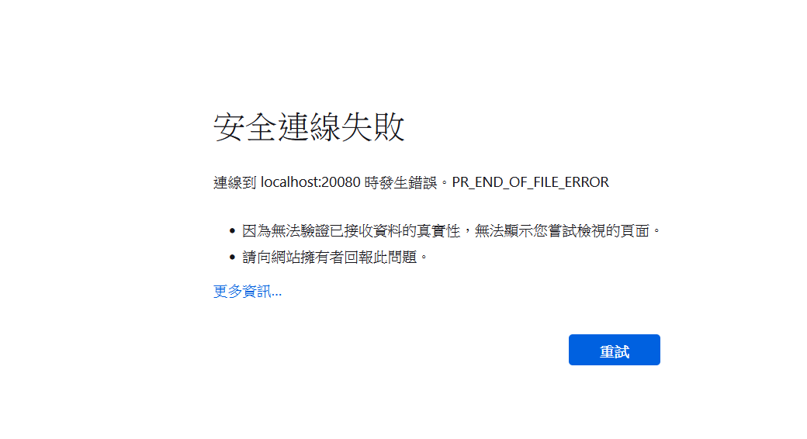
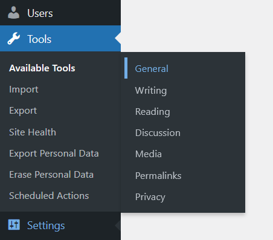
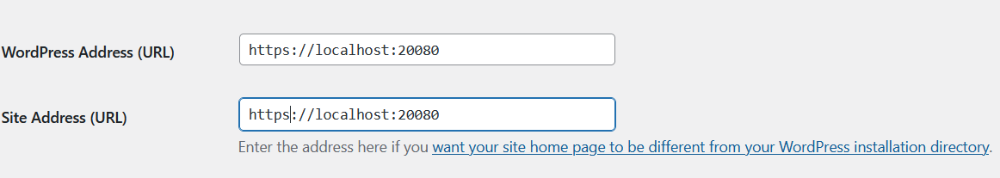
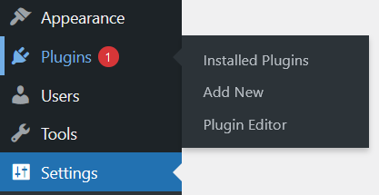
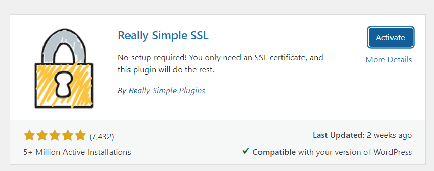
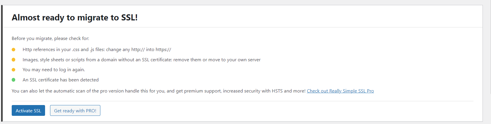

The following steps can make the store website compliance with PCI SSI requirements

1. Get a SSL(https) for the website

Although this is not required for PCI Compliance, SSL can transfer customers more securely.
When the customers enter personal information like name, billing addresses and credit card information
SSL will encrypt those data in case it is not readable to attackers even if they intercepts it

WooCommerce has its own settings to configure SSL certificates for new stores and existing stores

For New websites/stores:
	
	SSL certificate need to be installed first, if not, error will be shown (failed to establish secure connection)
	
	
	Click Settings > General 
	

	Update the WordPress Address and Site Address to include https
	
	
	Save changes
	
	
For existing websites/stores:
	
	It is because your website has already been indexed under http, redirect to https is required
	
	Really Simple SSL is a simple plugin to achieve this
	
	To Set up:
		
		Navigate to plugin > Add New > Search Really Simple SSL
		
		
		Install > Activate
		
		
		If SSL certificate is ready, simply click activate SSL to enable SSL migration
		
		
2. Check your PCI SAQ
	
	PCI SAQ (PCI Self-Assessment Questionnaire) is a list of yes / no questions of how your store handles
	cardholders information. 
	
	Choose SAQ A if:
		
		If your customers enter their information on a Third-Party Payment Page such as PayPal, Chase Paymentech
		Your website barely saves the credit card information of the customers.
		
		Website for SAQ A is: [here](https://www.pcisecuritystandards.org/documents/PCI-DSS-v3_2_1-SAQ-A.pdf?agreement=true&time=1636864424086)
		
	Choose SAQ A-EP if:
	
		If your customers enter their information on your hosted site, although those data will be encrypted using tokenization
		when enters your site.It is possible that hackers can install malware to get those information before those information
		encrypted. Example using this payment methods are WooCommerce's Stripe.SAQ A-EP is longer than SAQ A because it involves
		in more security concerns.
		
		Website for SAQ A-EP is: [here] (https://www.pcisecuritystandards.org/documents/PCI-DSS-v3_2_1-SAQ-A_EP.pdf?agreement=true&time=1636864424097)

3. Submit yur PCI SAQ
	
	For SAQ A, you only need to keep your SAQ on a file and send to an "Enforcing Organization" such as acquiring bank on request.
	
	For SAQ A-EP, you need to use a PCI-Approved Scanning Vendor (ASV) to scan your website to see if there is any malware
	and submit successful scan to the enforcing organizations.
	
	[Here are the list of ASV] (https://www.pcisecuritystandards.org/assessors_and_solutions/approved_scanning_vendors)
	

And you are good to go!
	

	
	
	

		
	
		

	
	

