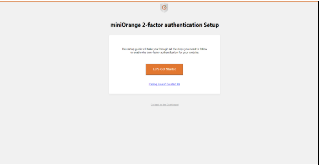

We will use miniOrange Two-Factor authentication plugin in this scenario 

When set up finished, you can go to Plugin à add Plugin to search miniOrange Two Factor
and install it.

When you installed  miniOrange Two-Factor authentication, you will go to setup page to setup.

It has eight types of authentication method can configure, which is Google Authenticator, OTP Over SMS (Registration required), OTP Over Email, Security Questions ( KBA ), Microsoft Authenticator, Authy 2-Factor Authentication, Duo Push Notification and OTP Over Telegram.

We will choose Security Questions ( KBA) to be Two-Factor Authentication in this scenario 

You need to configure three security questions. It is because each login will provide random two question to user. For question1, the question is What is your first company name? . The answer is company. For question2, the question is What is your favourite sport? . The answer is football. For question3, the question is What is abcde? . The answer is 12345.

After the configure security questions, the set up is finished. 

 