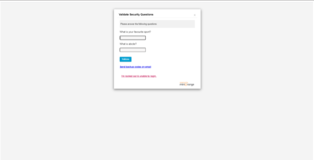

Now, you will back to wordpress of the setting of miniOrange Two-Factor authentication
[Text Wrapping Break]

You should enable plugin log to check the login information, user configure Two-Factor authentication method. When plugin log enables, you can check it in the docker. It is because it can help you to administration the user login. 

After that, you need to login out and login again wordpress again. After input the username and password, it will have validated security question to verify. It is because each of the login time will provide different question. Therefore, you can go to pervious page to check the validated security question answer. 

Now, you go to katacoda and launch mysql container 

docker exec -it mysql bash {{execute}}

You should login mysql database server by using wordpress account 

mysql -u wordpress -p {{execute}}

After that, input 12345 to be a password of  wordpress account.

You need to type show databases to show what kind of database in mysql.

show databases; {{execute}}

After that, you should use wordpress database to check the plugin log. 

use wordpress; {{execute}}

Now, you can see all of the tables in the wordpress databases.

show full tables; {{execute}}

Now, you can check what of the user using what kind of Two-Factor Authentication method in wordpress

select user_id, mo2f_configured_2FA_method from wp_mo2f_user_details; {{execute}}

The results show that user_id 1 using security questions to be Two-Factor Authentication method. This table(wp_mo2f_user_details) can let you know which kind of user information using what kind of Two-Factor Authentication method. 

