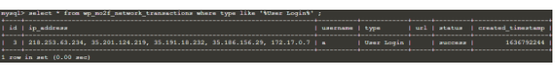
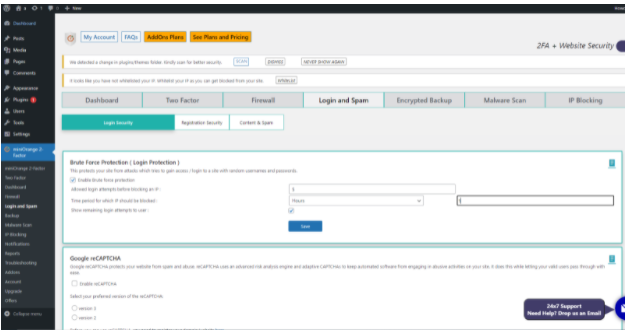
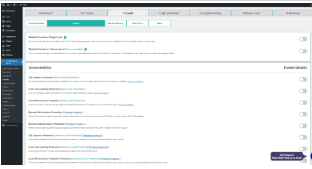
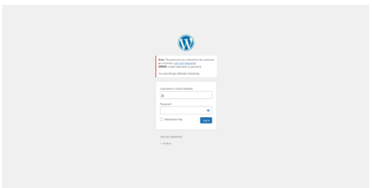
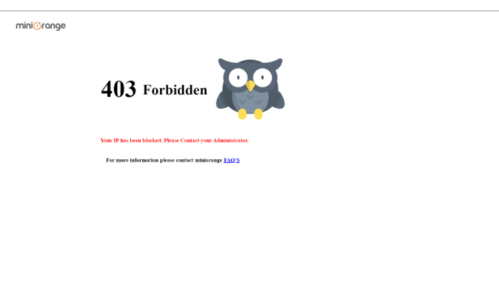
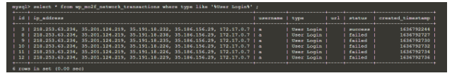

Now, you can execute other SQL. This SQL will provide the login information about user.

select * from wp_mo2f_network_transactions where type like '%User Login%'; {{execute}}

The results show that it has ip address of that user and it can check the login success or not. In the table wp_mo2f_network_transactions, you can check the status is sucessful or not when the type is user login. Therefore, It can help to maintain the security if the invaild login occur. 

Now, you need to the setting of miniOrange Two-Factor authentication in wordpress. You should enable 2FA + website security first. After that, you should enable Brute Force Protection (Login Protection ). This login protection can set limit the login attempt. Also, it will block IP when the wrong login attempt too much. You can set the allowed login attempts to be five time and set the time period to 1 hours first. You can enable to show the remaining login attempts to user. This login protection will record data in table wp_mo2f_network_transactions .

On the other hand, miniOrange Two-Factor authentication in wordpress provide firewall to enable 

You should type 5 times wrong username or password in the wordpress. After that, press f5. 

 

You will see this picture when you type 5 times wrong username or password in the wordpress. It means that you are blocked by miniOrange Two-Factor authentication. 

Now, you katacoda to execute  SQL to show about User Login status 

select * from wp_mo2f_network_transactions where type like '%User Login%' ; {{execute}}

